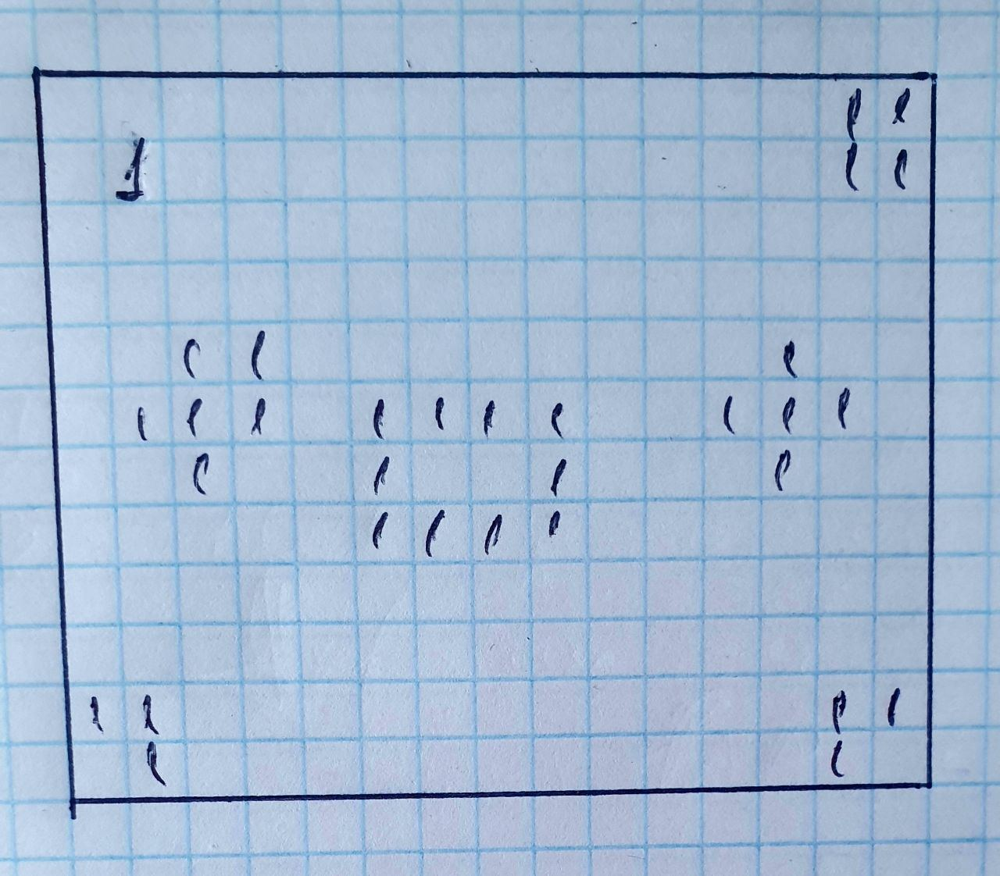

 [Поиск количества островов.](https://github.com/Razum4e/TaskNAUKA/blob/master/src/main/java/MatrixSea/Main.java)
 
 

[Перевернуть строку.](https://github.com/Razum4e/TaskNAUKA/blob/master/src/main/java/FlipString/Main.java)

[Проект БД из 3х таблиц.](https://github.com/Razum4e/TaskNAUKA/blob/master/src/main/java/PostgreSQL/Main.java)
